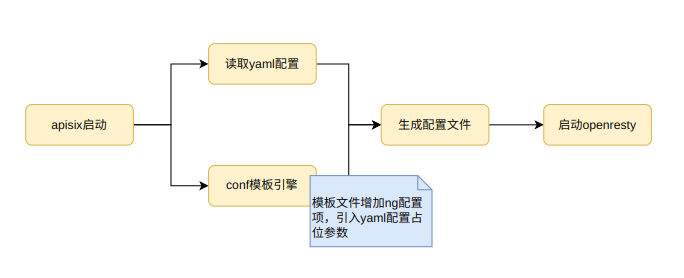

# apisix中的ng配置注入
> apisix是基于openresty实现的网关组件，其启动及运行原理仍然是与原生nginx一样依赖`nginx.conf`配置，本质上都是nginx程序与lua脚本扩展，lua常用于C/C++进程的扩展脚本，如redis也支持lua脚本。apisix通过luajit脚本启动时，先根据配置及模板生成nginx.conf文件，然后命令启动openresty进程加载配置。在nginx使用过程中经常会遇到配置多个服务域名或端口应对不同场景，如本地静态资源、内部服务代理，笔者在此文中实现apisix启动时注入nginx.conf文件增加配置仅允许本机访问的端口，用于代理apisix的mysql配置服务。

## 基本思路
1. 模板代码`cli/ngx_tpl.lua`中增加规则表达式，引入配置变量；
2. 读取yaml配置，结合模板引擎生成配置文件



## 具体实现
apisix的启动模块是`cli/ops.lua`，脚本中的`init() / start()`等方法对应启动命令的执行块，其中init()方法包括生成格式化的配置、生成nginx.conf文件。
### 模板引擎改写
如下实现新端口代理服务，在`cli/ngx_tpl.lua`文件中的http项中增加upstream及server配置项表达式，如果存在admin_config_server_address、admin_config_server_uri参数则写入配置。

```lua
-- upstream配置表达式

upstream admin_config_backend {
    {* admin_config_server_address *}

    keepalive 320;
    keepalive_requests 1000;
    keepalive_timeout 60s;
}


-- server配置表达式

server {
    listen 127.0.0.1:9082;
    
    allow 127.0.0.1;
    deny all;

    location {* admin_config_server_uri *} {

        proxy_pass        http://admin_config_backend;
        proxy_set_header  HOST  $host;

        body_filter_by_lua_block {
            apisix.admin_config_callback()
        }

    }
}

```

### 配置读取生成文件
在`config.yaml`文件中增加配置项，apisix初始化时会将此文件配置与default配置合并写入内存。

```yaml
deployment:
  # mysql配置服务地址
  config_server_route:
    address_list:
      "127.0.0.1": 8081
    uri: /apisix-config
```

## 自测效果