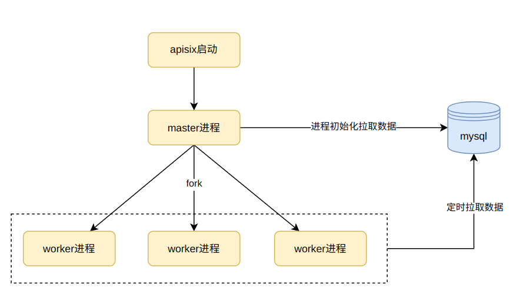
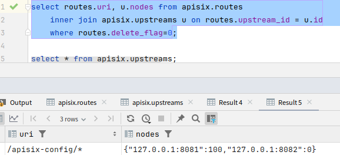
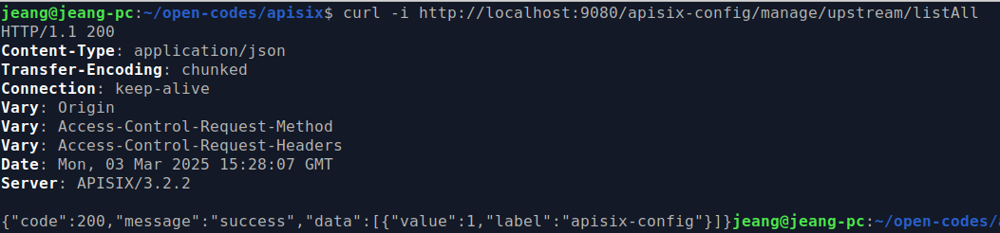
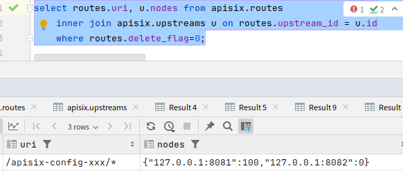
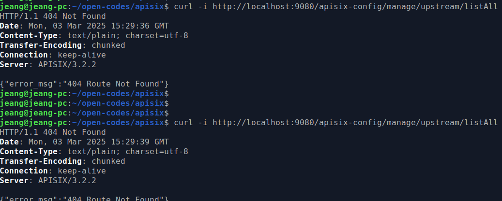

# apisix配置mysql存储改造
> apisix默认使用etcd存储配置，具有分布式、一致性、高并发、实时监听通知、目录存储、支持前缀遍历查询等特性，非常适合做路由配置，当配置变更时也能及时被客户端监听消费，较关系性数据库如mysql等存储更有优势。
但在某些不涉及高并发、对于配置生效实时要求亦不高的场景，或没有条件安装etcd，可尝试使用mysql存储配置及管理，助于降低系统服务组件数量、简化系统架构。此文中笔者实现了apisix如route、upstream、plugin等主要配置mysql存储改造，自测能跑通基本功能。水平有限，不对的地方请大佬轻喷~

## 方案简述
apisix是基于openresty基础上扩展丰富lua脚本实现的网关组件，在openresty进程启动后的不同阶段执行对应脚本功能。master进程启动时，执行`apisix/init.lua::http_init()`模块，引入`config_mysql`配置模块执行init初次拉取配置；fork出来的子进程worker继承master进程中的内存数据，并执行`apisix/init.lua::http_init_worker() -> config_mysql.lua::init_worker()`，定时调试从mysql中拉取配置。



## 具体实现
### mysql数据源配置
#### 数据库参数配置
实现`config.yaml`文件支持mysql类型的数据源配置如下所示，便于数据源参数可配置化。修改`apisix/cli/schema.lua`文件，增加`data_plane.role_data_plane.config_provider`支持mysql枚举项。
```yaml
deployment:
  role: data_plane
  role_data_plane:
    config_provider: mysql
  mysql:
    host: 127.0.0.1
    port: 3306
    database: apisix
    user: jeang
    password: xxxxxx
    charset: utf8
    keepalive: 60000
    pool_size: 20
    backlog: 200
```
`apisix/cli/schema.lua`文件增加类型
```lua
local deployment_schema = {
    traditional = {...}, -- 示例省略
    control_plane = {...}, -- 示例省略
    data_plane = {
        properties = {
            role_data_plane = {
                properties = {
                    config_provider = {
                        enum = {"control_plane", "yaml", "xds", "mysql"}  -- 增加msql项
                    } -- ....
                }
            }
        }
    },
    --其它配置...
}
```
`apisix/cli/file.lua::read_yaml_conf()`脚本方法增加解析配置
```lua
elseif default_conf.deployment.role == "data_plane" then
    if default_conf.deployment.role_data_plane.config_provider == "yaml" then
        default_conf.deployment.config_provider = "yaml"
    elseif default_conf.deployment.role_data_plane.config_provider == "xds" then
        default_conf.deployment.config_provider = "xds"
    -- 此处为增加的配置提供者类型
    elseif default_conf.deployment.role_data_plane.config_provider == "mysql" then
        default_conf.deployment.config_provider = "mysql"
    else
        default_conf.etcd = default_conf.deployment.role_data_plane.control_plane
    end
    default_conf.apisix.enable_admin = false
end
```


#### 数据库参数加载
读取`config.yaml`文件中的数据库参数，在服务启动时加载至内存中。    
`apisix`启动过程：由`shell`命令脚本(一般是`/usr/bin/apisix`)运行lua脚本，初始化`nginx.conf`等文件后启动`openrestry`进程，其中在`worker`进程初始化时调用`apisix/init.lua`脚本中的`http_init_worker()`方法，此方法初始化插件、路由等组件，并加载存储网关配置的数据源（比如etcd）。在apisix中，每种数据源组件都实现如apisix_{数据源类型}，便于在加载时根据类型名称动态加载脚本，这里用的是mysql，所以参考`config_yaml.lua`实现了公共方法的`config_mysql.lua`脚本(类似于动态继承)，加载脚本初始化方法时，读取mysql数据库配置至worker进程缓存，以便于后续使用。核心代码如下
```lua
-- master进程初始化调用
function _M.init()
    local local_conf, err = config_local.local_conf()
    if not local_conf then
        return nil, err
    end
    mysql_config = local_conf.deployment.mysql
    log.info("mysql config ", json.delay_encode(mysql_config))
    mysql_cli = mysql_ds:new(mysql_config)

    if not apisix_mysql then
        apisix_mysql = {}
    end
    read_apisix_mysql()
    return true
end

-- woker进程初始化调用
function _M.init_worker()
    local local_conf, err = config_local.local_conf()
    if not local_conf then
        return nil, err
    end
    mysql_config = local_conf.deployment.mysql
    log.info("mysql config ", json.delay_encode(mysql_config))
    mysql_cli = mysql_ds:new(mysql_config)
    -- sync data in each non-master process 定时同步
    ngx.timer.every(30, read_apisix_mysql)

    return true
end
```


### 配置数据查询与封装
通过apisix官网上的API数据结构，转换为关系型mysql表结构，并实现应用层简单ORM映射。
#### mysql DDL脚本
```sql
create schema apisix collate utf8mb4_0900_ai_ci;

create table routes
(
    id               int auto_increment  primary key,
    name             varchar(100)  default ''                null,
    uri              varchar(4096) default ''                null comment '接口地址',
    uris             varchar(4096) default ''                null comment '接口地址',
    priority         int           default 0                 null comment '优先级',
    methods          varchar(1024) default ''                null comment '方法集合，json_array',
    hosts            varchar(2048) default ''                null comment '来源hosts，json_array',
    remote_addrs     varchar(2048) default ''                null comment '客户来源IP集合，json_array',
    vars             varchar(1024) default ''                null,
    enable_websocket tinyint(1)    default 0                 null,
    upstream_id      varchar(32)   default ''                 null comment '上游id，关联键',
    service_id       varchar(32)   default ''                 null,
    plugin_config_id varchar(32)   default ''                 null comment '配置ID',
    plugins          text                                    comment '插件配置',
    mark_desc        varchar(256)  default ''                null,
    status           tinyint       default 1                 null comment '状态',
    delete_flag      tinyint(1)    default 0                 null,
    create_time      datetime      default CURRENT_TIMESTAMP not null,
    update_time      datetime      default CURRENT_TIMESTAMP not null on update CURRENT_TIMESTAMP
)
    comment '服务路由及接口';

create table upstreams
(
    id            int auto_increment primary key,
    name          varchar(64)   default ''                null,
    upstream_code varchar(64)   default ''                null comment '唯一标识',
    type          varchar(10)   default ''                not null,
    nodes         text                                    not null comment '服务地址，json串',
    retries       int           default 0                 null comment '重试次数',
    timeout       varchar(1024) default ''                not null comment '超时时间',
    retry_timeout int           default 0                 null comment '重试时间',
    scheme        varchar(32)   default ''                null,
    hash_on       varchar(20)   default ''                null,
    upstream_key  varchar(256)  default ''                null,
    mark_desc     varchar(256)  default ''                null,
    delete_flag   tinyint(1)    default 0                 null,
    create_time   datetime      default CURRENT_TIMESTAMP not null,
    update_time   datetime      default CURRENT_TIMESTAMP null on update CURRENT_TIMESTAMP
)
    comment '上游服务';

create table plugin_configs
(
    id                 int auto_increment primary key,
    plugin_config_code varchar(64)  default ''                not null,
    plugins            text                                   null comment '插件参数配置',
    mark_desc          varchar(256) default ''                null,
    delete_flag        tinyint      default 0                 not null,
    create_time        datetime     default CURRENT_TIMESTAMP not null,
    update_time        datetime     default CURRENT_TIMESTAMP not null on update CURRENT_TIMESTAMP
)
    comment '插件配置';

create table sys_dict
(
    id              int auto_increment  primary key,
    dict_key        varchar(32) default ''                null comment '字典项',
    dict_item_key   varchar(32)                           null comment '配置项key',
    dict_item_value text                                  null comment '配置项值',
    delete_flag     tinyint     default 0                 not null comment '删除标识',
    update_time     datetime    default CURRENT_TIMESTAMP null on update CURRENT_TIMESTAMP
)
    comment '公共字典';

```

#### 应用查询封装
`mysql_ds.lua`脚本实现数据库连接初始化，路由、代理服务、插件等配置查询某时间段内的变更，数据封装至`table`，代码示例如下

```lua
-- 按时间查询路由
function _M.query_routes_by_time(self, fetch_start_time, fetch_end_time)
    local nowStr = os.date("%Y-%m-%d %H:%M:%S", fetch_end_time)
    local route_last_ctime = "0000-00-00 00:00:00"
    if nil ~= fetch_start_time then
        route_last_ctime = os.date("%Y-%m-%d %H:%M:%S", fetch_start_time)
    end

    local query_routes_sql = format(self.query_routes_sql_template, route_last_ctime, nowStr)
    log.info("query routes ", query_routes_sql)
    
    local db_cli = get_conn(self.db_config)
    local res, err, errcode, sqlstate = db_cli:query(query_routes_sql)
    if not res then
        log.error("query routes error: ", err, ", ", errcode, ", ", sqlstate)
        return    
    end

    close_conn(db_cli, self.db_config)

    if nil == next(res) then
        log.info("no new routes info")
        return
    end
    log.info("query route: ", err)
    local route_list = res
    local route_map = new_tab(0, #route_list)
    for i, route in ipairs(route_list) do
        route.enable_websocket = (route.enable_websocket == 1)
        if route.uris then
            route.uris = json.decode(route.uris)
        end
        if route.methods then
            route.methods = json.decode(route.methods)
        end
        if route.hosts then
            route.hosts = json.decode(route.hosts)
        end
        if route.vars then
            route.vars = json.decode(route.vars)
        end

        route_map["r" .. route.id] = route
    end
    
    log.info("query routes list ", json.delay_encode(route_list), ", ", json.delay_encode(route_map))

    return route_list, route_map
end
```

### 增量配置同步
服务缓存与数据库配置同步采用全量与增量结合的方式主动同步数据：服务启动时查询全表数据初始化缓存，注入定时任务查询增量数据与缓存对比合并。

```lua
-- 读取配置，apisix_mysql_ctime为全局参数初始化为0，表示最近更新缓存的时间
local function read_apisix_mysql(premature, pre_mtime)
    if premature then
        return
    end

    local current_time = ngx.time()
    if apisix_mysql_ctime == current_time then
        log.info("无时间变化，不拉最新数据")
       return 
    end

    local old_routes = nil
    local old_upstreams = nil
    local old_plugin_confs = nil
    local old_global_rules = nil
    if nil ~= apisix_mysql and next(apisix_mysql) ~= nil then
        old_routes = apisix_mysql["routes"]
        old_upstreams = apisix_mysql["upstreams"]
        old_plugin_confs = apisix_mysql["plugin_configs"]
        old_global_rules = apisix_mysql["global_rules"]
    end

    -- 增量查询并合并缓存
    local new_routes = merge_change_routes(apisix_mysql_ctime, current_time, old_routes)
    local new_upstreams = merge_change_upstreams(apisix_mysql_ctime, current_time, old_upstreams)
    local new_plugin_cons = merge_change_config(apisix_mysql_ctime, current_time, old_plugin_confs, mysql_cli.query_plugin_configs_by_time)
    local new_global_rules = merge_change_config(apisix_mysql_ctime, current_time, old_global_rules, mysql_cli.query_global_rules_by_time)

    apisix_mysql.routes = new_routes
    apisix_mysql.upstreams = new_upstreams
    apisix_mysql.plugin_configs = new_plugin_cons
    apisix_mysql.global_rules = new_global_rules

    apisix_mysql_ctime = current_time
    log.info("当前配置为 ", json.delay_encode(apisix_mysql, true))
end
```

## 自测效果
1. 数据库DML添加数据；
```sql
-- 上游服务upstreams
INSERT INTO apisix.upstreams (id, name, upstream_code, type, nodes, retries, timeout, retry_timeout, scheme, hash_on, upstream_key, mark_desc) VALUES (1, 'apisix-config', 'apisix-config', 'roundrobin', '{"127.0.0.1:8081":100,"127.0.0.1:8082":0}', 3, '', 0, 'http', '', '', 'apisix配置管理服务');
INSERT INTO apisix.upstreams (id, name, upstream_code, type, nodes, retries, timeout, retry_timeout, scheme, hash_on, upstream_key, mark_desc) VALUES (2, 'apisix-test', '', 'roundrobin', '{"127.0.0.1":8082}', 3, '', 0, 'http', '', '', '');

-- 路由配置routes
INSERT INTO apisix.routes (id, name, uri, uris, priority, methods, hosts, remote_addrs, vars, enable_websocket, upstream_id, service_id, plugin_config_id, mark_desc, status) VALUES (1, '路由配置', '/apisix-config/*', '["/apisix-config/*"]', 1, '[]', '', '', '', 0, '1', '', '', '路由配置', 1);

-- 查询sql配置结果
select routes.uri, u.nodes from apisix.routes
    inner join apisix.upstreams u on routes.upstream_id = u.id
    where routes.delete_flag=0;
```




2. 启动代理`apisix start`，启动上游8081端口的服务;
3. 请求接口
```sh
curl -i http://localhost:9082/apisix-config/manage/upstream/listAll
```



4. 修改后再次请求，修改uri为`/apisix-config-xxx/*`，则无法找到路由；




